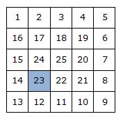

# Spiral 🎯

Sizdən aşağıdakı tapşırığı həll etmək tələb olunur. Əvvəlcə tapşırığın şərtini oxumağı unutmayın.

Tapşırıqların nümunə həllərini [instructions](../instructions) folderində tapa bilərsiniz :information_source:

#### Tapşırıqları həll etmək üçün bilməli olduğunuz mövzular

* İki ölçülü massivlər
* İç içə dövr strukturları


**Yekun qeydlər**: 

* *Tapşırıqları vaxtında həll etməyi və göndərməyi unutmayın* ⏳
* *Tapşırığın həllini [main.js](./main.js) faylında yazmaq zəruridir!* :warning:

---

#### Tapşırığın şərti



1-dən n**2 - dək ədədlər n x n ölçülü kvadrat matrisin yuxarı sol küncündən saat əqrəbinin hərəkəti istiqamətində şəkildə göründüyü kimi spiralvari şəkildə yazılmışdır.

i-ci sətirdə və j-ci sütunda yerləşən ədədi tapın.


#### Giriş verilənləri
Giriş faylında n, i, j (1 ≤ i, j ≤ n ≤ 100) natural ədədləri verilir.


#### Çıxış verilənləri
Çıxış faylında koordinatları i, j olan ədədi vermək lazımdır.


---

:clock2: Zaman məhdudiyyəti 1 saniyə

:floppy_disk: Yaddaşı istafadə məhdudiyyəti 128 MiB

---

**Giriş verilənləri** 

*[main.js](./main.js) faylında verilmişdir*
```javascript
let n = 5;
let i = 4;
let j = 2;
```

**Çıxış verilənləri**

```
23
```


---

**[TechAcademy](https://www.tech.edu.az/) tərəfindən yaradılıb**

---
